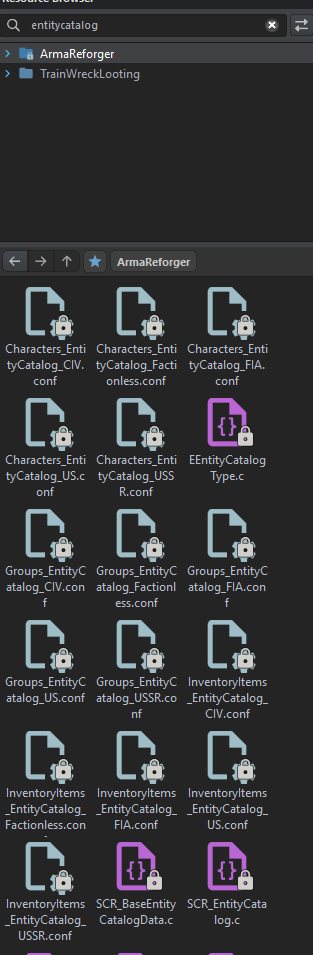
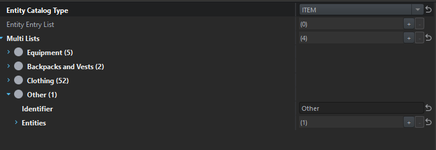
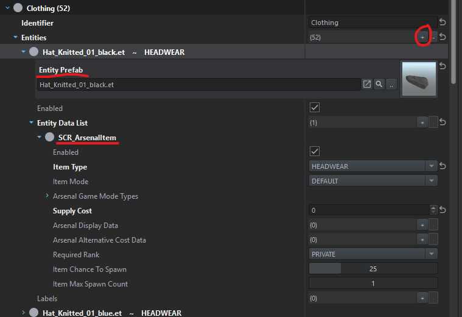
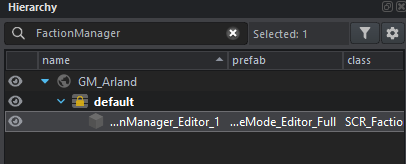
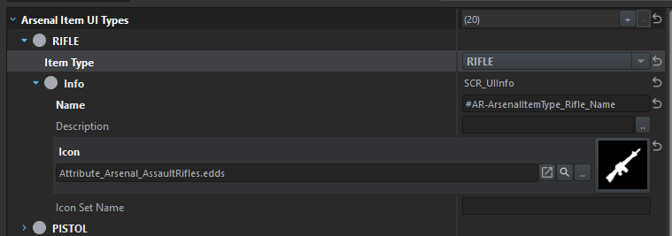
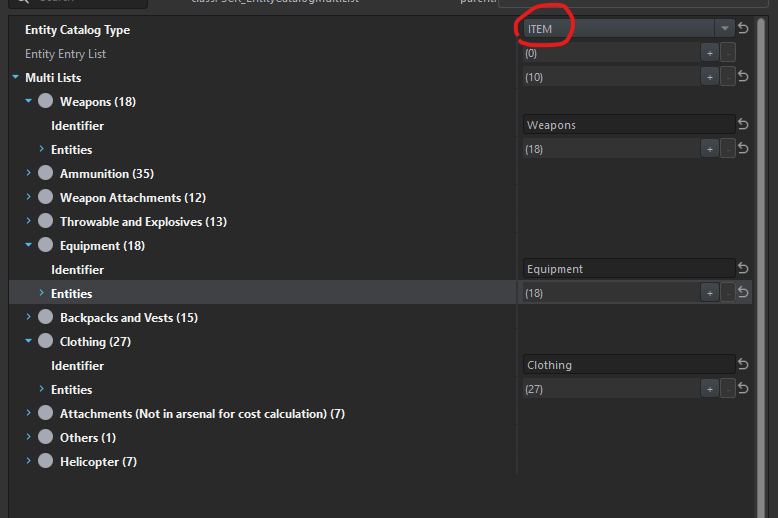
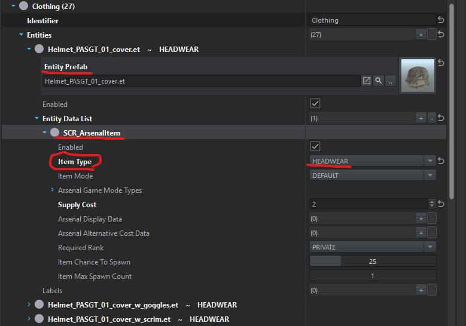

# Entity-Catalog

Are you looking for a specific item that's not appearing in the loot-table? Doesn't appear
in the Arsenal either?

Odds are, it's not in the catalog! Our loot-tables are generated from the catalog in the
faction manager. So if it's not there, it's not going to be in the loot-table.

----

## Where to go

### If we're modifying base-game gamemodes:

Within the resource browser, type `EntityCatalog`. You'll find a bunch of variations from
**characters**, **groups**,  to **inventory items**.

For this example, we'll pretend we want to add something to the civilian faction's inventory. Worth 
clarifying that our loot-table aggregates everything. It doesn't actually matter which 
faction you add things to. Do understand that if you plan on using an Arsenal, whatever you
change will impact the Arsenal of said faction.



If you were to open up `InventoryItems_EntityCatalog_CIV.conf` you should see something like 
the following:



Right click on the file and select `Override`. This will allow you to customize this file!
At this point, you can add whatever you want to whichever category you'd like.



### If you're modifying a modded gamemode/scenario

You need to open the world/scenario up and locate the `FactionManager` entity in the hierarchy.



Are they using a prefab? Or is it a hand-placed entity where they customized the contents on the spot?
You should be able to see a blue-link on fields which use a configuration file instead of hand-jamming things.
The blue link lets you right click to navigate towards the configuration file being used.

If it's a prefab that's hand-jamming things in there... well... you're going to have to override
things. You can click on the faction manager entity, right click `Locate Nested Prefab` or press `Shift + P`. 
Then you can override from there.

----

## Can I add a new category?

Are the base categories not enough? You want to add a new category? Sure, that's possible.

You will have to do a bit of scripting... 

Note at the time of writing this, the `SCR_EArsenalItemType` enum has 22 entries. It's possible 
this grows overtime... so between Reforger updates, or even when working with other mods, verify
the number you pick down below doesn't conflict with anyone else.

```c
modded enum SCR_EArsenalItemType
{
    MyAwesomeCategory = 1 << 23
};
```

At this point, you should be able to add your new category to the `ArsenalItemTypeUIConfig.conf`.

Within the resource browser, search for `ArsenalItemTypeUIConfig.conf`, and override it.



You should be able to add a new entry, select the enum value you just created, and then
add the UI information. 

You don't have to do the localization if you don't want to... could simply put "My Awesome Category"
for the "Name" field. This is what appears within the game, if you want to play nicely.

Finally, you can start using your new category! Whenever you're changing a catalog, make sure you're 
updating a catalog that's of "Item" type. It should appear at the top of the inspector.



The multi-lists don't matter as much. You should be able to create a new list for 
organizational purposes, or simply add it to an existing one (depending on your needs).



The items in red are the important bits to have when adding new entries.

- The prefab... which is required. Game needs to know what to spawn!
- Entity Data List
  - Add a new entry using the `SCR_ArsenalItem` config type. Should be the first item in the dropdown.
  - Change the `Item Type` to your new category (whichever is appropriate)
  - Recommend to have a reasonable supply cost. A few members of the community have been discussing leveraging supply cost to help drive default chance values in the loot table.
